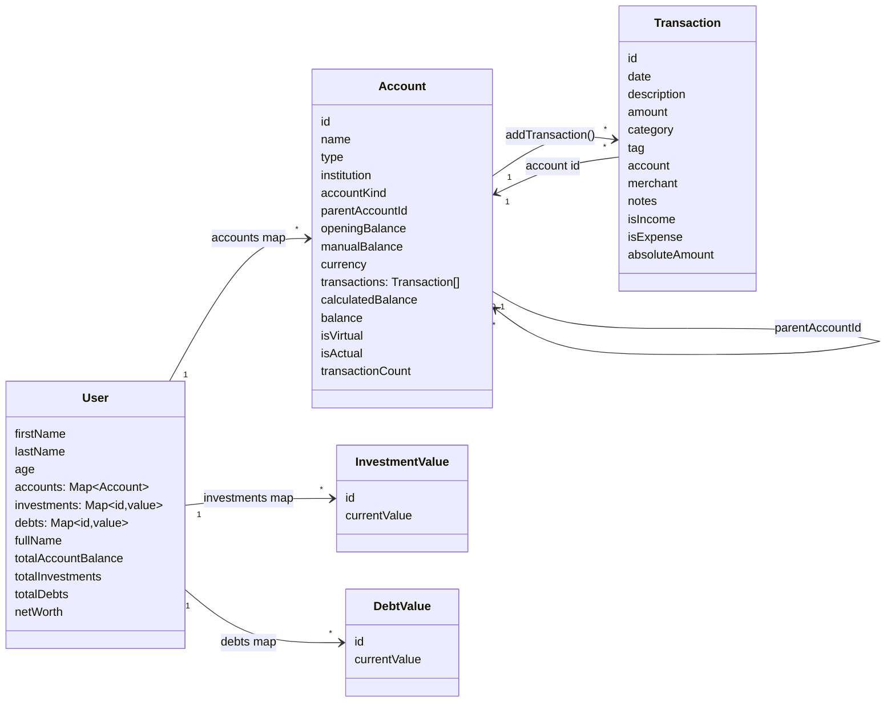
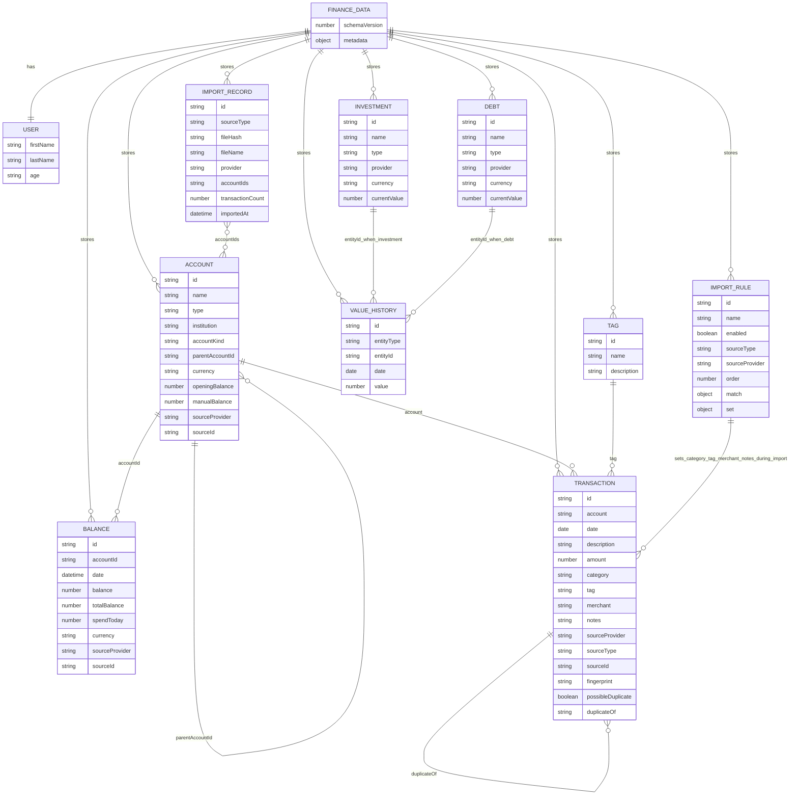

# Model And Data Flow Graph

This repo has three runtime class models in `src/models`:

- `User`
- `Account`
- `Transaction`

The canonical persisted model is the normalized finance data shape in
`src/data/vault/financeData.js`. It is what `.pfa`, Excel, Monzo JSON, and CSV
imports are converted into before the app renders data.

## Runtime Model Graph

## Persisted Finance Data Graph

## End-To-End Data Flow

```mermaid
flowchart LR
  subgraph Inputs
    Excel["Excel workbook (.xlsx)"]
    Csv["Bank CSV import"]
    MonzoJson["Monzo JSON export"]
    PfaOpen["Encrypted PFA vault (.pfa)"]
  end

  subgraph ImportAndNormalize["Import and normalize"]
    ParseSpreadsheet["parseSpreadsheet()"]
    ExcelAdapter["excelFileToFinanceData()"]
    ParseCsv["parseImportFile()"]
    CsvAdapter["Monzo CSV adapter"]
    Rules["applyRulesToImportBatch()"]
    AssignAccount["assignImportBatchAccount()"]
    EditedImport["financeDataFromEditedImport()"]
    MonzoAdapter["monzoJsonFileToFinanceData()"]
    OpenVault["openPfaVault()"]
    Normalize["normalizeFinanceData()"]
    Merge["mergeFinanceData()"]
  end

  subgraph CanonicalStore["Canonical store"]
    FinanceData["FinanceData JSON model"]
    VaultParts["metadata/user/accounts/balances/transactions/tags/investments/debts/valueHistory/imports/importRules"]
  end

  subgraph RuntimeApp["Runtime app model"]
    AppData["appDataFromFinanceData()"]
    UserModel["User"]
    AccountModels["Map<Account>"]
    TransactionModels["Transaction[]"]
    Ui["App.jsx tables, preview, net worth"]
  end

  subgraph Outputs
    CreateVault["createPfaVault()"]
    ExportExcel["downloadUpdatedSpreadsheet()"]
    PfaOut["Encrypted PFA vault"]
    ExcelOut["Excel workbook"]
  end

  Excel --> ParseSpreadsheet --> ExcelAdapter --> Normalize
  Csv --> ParseCsv --> CsvAdapter --> Rules --> AssignAccount --> EditedImport --> Normalize
  MonzoJson --> MonzoAdapter --> Normalize
  PfaOpen --> OpenVault --> Normalize

  Normalize --> Merge
  Merge --> FinanceData
  Normalize --> FinanceData
  FinanceData --> VaultParts

  FinanceData --> AppData
  AppData --> UserModel
  AppData --> AccountModels
  AppData --> TransactionModels
  UserModel --> Ui
  AccountModels --> Ui
  TransactionModels --> Ui

  FinanceData --> CreateVault --> PfaOut
  FinanceData --> AppData --> ExportExcel --> ExcelOut
```

## Key Flow Notes

- `FinanceData` is the canonical model. It is normalized and validated before use.
- `appDataFromFinanceData()` turns canonical records into runtime `User`,
  `Account`, and `Transaction` instances.
- `financeDataFromAppData()` turns runtime data back into normalized records.
- `Transaction.account` must reference an existing `Account.id`.
- `Account.parentAccountId` creates account hierarchy, such as Monzo pots under a
  main account.
- `Transaction.tag` is the spreadsheet `tagId` field and points to `Tag.id`
  when tags are present.
- `Balance.accountId` points to `Account.id` and captures point-in-time balances,
  mainly from Monzo JSON imports.
- `ValueHistory.entityType` plus `entityId` points at investments or debts in the
  current spreadsheet/vault model.
- `ImportRecord.fileHash` is used to detect duplicate imports.
- `ImportRule` is stored in the vault and applies only during staged CSV import;
  it can set `category`, `tag`, `merchant`, and `notes`.
